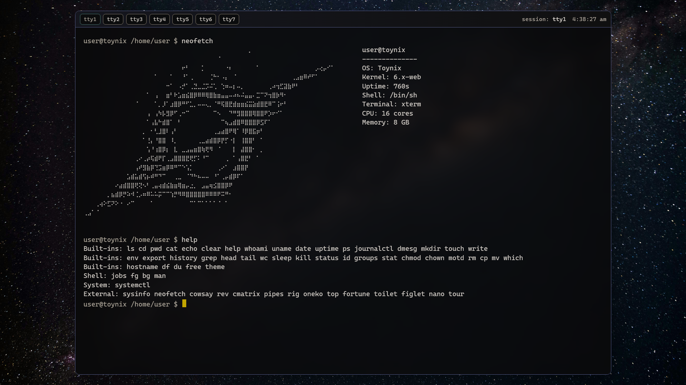
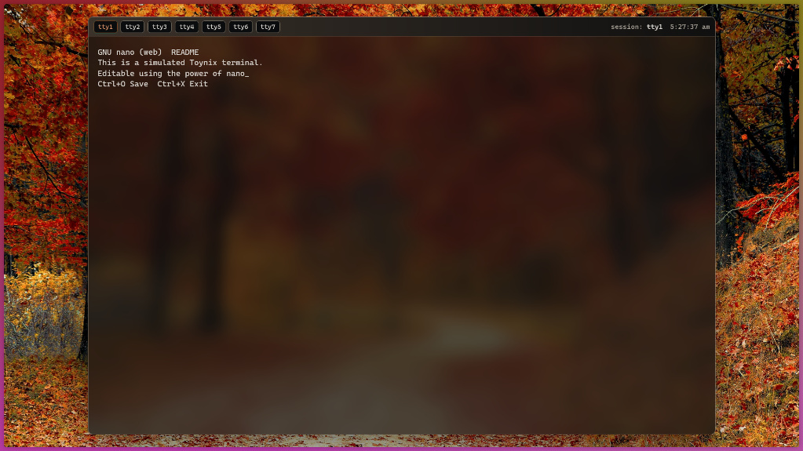

# 🍂 Toynix TTY

### *A Browser-Native Unix-Like Environment & Digital Relic*

Toynix is a sophisticated browser-based OS simulation designed with an emphasis on **stateless immutability**, **atmospheric aesthetics**, and **POSIX-like behavior**. It is not a hardware emulator, but a modular runtime that leverages modern browser APIs to provide a "Near-Kernel" experience.

---

## 📸 System Gallery

### Space Theme


### Autumn Theme


---

## 🚀 Deployment & Usage

### **Recommended: Local Live Server**

Due to strict browser security policies (COOP/COEP) and high-performance TTY virtualization, **Toynix is best experienced via a local development server.**

1. **Clone the repository:**
```bash
git clone https://github.com/Coding-Club-SET-NU/toynix.git
cd toynix

```


2. **Run with Live Server:**
* **VS Code:** Right-click `index.html` and select **"Open with Live Server"**.
* **Python:** `python -m http.server 8000`
* **Node/NPX:** `npx serve .`


### **Live Demo**

[View Toynix on Netlify](https://toynix.netlify.app)

> **Note:** If you experience `EACCES` or TTY lag on the live build, it is due to origin-isolation policies. Local hosting is recommended for the full "Root" experience.

---

## 🛠️ System Architecture

Toynix is built on a modular userland/kernel split:

* **VFS (Virtual File System):** Powered by **OPFS (Origin Private File System)** for persistence and an in-memory fallback.
* **Pseudo-Terminal (PTY):** Handles ANSI sequences, TTY switching (tty1-tty7), and real-time input buffering.
* **Worker-Based Userland:** Every command runs in a dedicated Web Worker, preventing the main UI thread from hanging during complex operations.
* **Pipelines & Redirection:** Supports standard Unix IO operations: `cat log.txt | grep "error" > debug.log`.

---

## 💻 Technical Breakdown

### **Core Components**

* **`src/vfs.js`**: Managed file metadata, OPFS handles, and `/home` mounts.
* **`src/journal.js`**: A `journald`-style log capture system for kernel and systemd events.
* **`src/pty.js`**: The virtualized teletype layer.
* **`src/procfs.js`**: Virtual data exposure via `/proc` (e.g., `cat /proc/cpuinfo`).

### **Built-in Commands**

Toynix comes with a full suite of binaries:

> `ls`, `cd`, `pwd`, `cat`, `echo`, `grep`, `mkdir`, `touch`, `nano`, `chmod`, `chown`, `ps`, `kill`, `uptime`, `free`, and more.

### **External Modules**

Riced for aesthetics: `neofetch`, `cmatrix`, `cowsay`, `oneko`, `figlet`, `top`.

---

## ⚙️ Boot Customization

You can inject custom kernel and systemd logs directly into the boot sequence via `index.html`:

```html
<script>
  window.TOYNIX_KERNEL_LOGS = [
    "[    0.000000] Toynix Kernel v1.0.4-arch",
    "[    0.420690] Initializing OPFS Persistence Layer...",
  ];
</script>

```